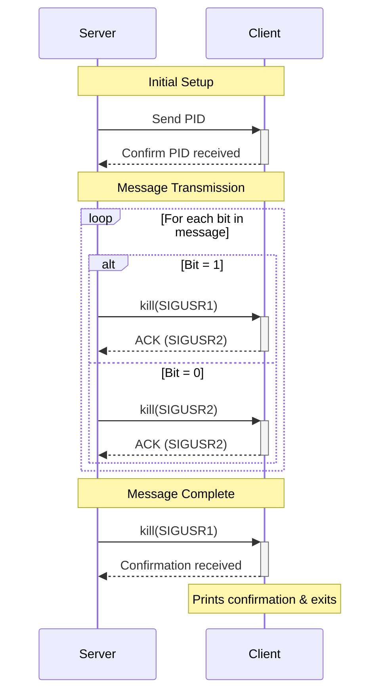

# minitalk
<p align="center">
	
	
	
	
</p>
## Overview

Minitalk is a simple client-server communication program implemented in C. It demonstrates Inter-Process Communication (IPC) using UNIX signals (SIGUSR1 and SIGUSR2). The client process sends a string message to the server process, encoding the message bit-by-bit using signals. The server listens for these signals, reconstructs the message, and prints it.

## About 
Minitalk employs a basic client-server architecture where communication relies solely on UNIX signals.

• Client-Server Model: A single server process listens for incoming messages from potentially multiple client processes (though concurrent messaging from multiple clients may lead to data corruption due to shared state in the server).

• Signal-Based IPC: Communication is achieved by sending signals between processes using the kill() system call.

• SIGUSR1: Represents the bit '0'.

• SIGUSR2: Represents the bit '1'.

• Bit-by-Bit Transmission: The client decomposes the message string into individual bits and sends one signal per bit.

• Message Reconstruction: The server receives signals, interprets them as bits (0 or 1), and reconstructs characters byte by byte (8 bits).

• State Management: Both client and server use static variables within their signal handlers and associated functions to maintain the state of the ongoing transmission (e.g., current bit position, partially reconstructed character, message buffer).

• Acknowledgement Mechanism:

• Bit Acknowledgment: After processing each bit signal, the server sends SIGUSR2 back to the client. The client waits for this signal before sending the next bit, ensuring synchronization.

• Message Confirmation: Once the server successfully reconstructs the entire message (terminated by a null character \0), it sends SIGUSR1 to the client as a final confirmation.

Communication Flow Diagram (Conceptual)


## Build and Run
### Building

The project uses Makefiles for building the executables and libraries.

1. Navigate to the project's root directory.

2. Build Libraries: The main Makefile likely depends on the Makefiles within libft/ and ft_printf/. Running make in the root directory should handle building dependencies first.

### Running the Server

1. Execute the compiled server binary:

```bash
./server
```
2. The server will print its PID:

```text
Server PID: <PID>
    Waiting for message...
```
3. Note down the PID. The server will now wait indefinitely for client connections.

### Running the Client

1. Open another terminal.

2. Execute the compiled client binary, providing the server's and the message string as arguments:

```bash
./client <PID> "Your message here!"
    # or for the bonus version:
    # ./client_bonus <PID> "Another message."
```

3. If successful, the client will exchange signals with the server. Upon receiving final confirmation (SIGUSR1) from the server, the client will print:

```text
Server: Message received
```
and exit.

4. The server terminal will print the received message:

```text
Waiting for message...
    ->Your message here!
    Waiting for message...
```
